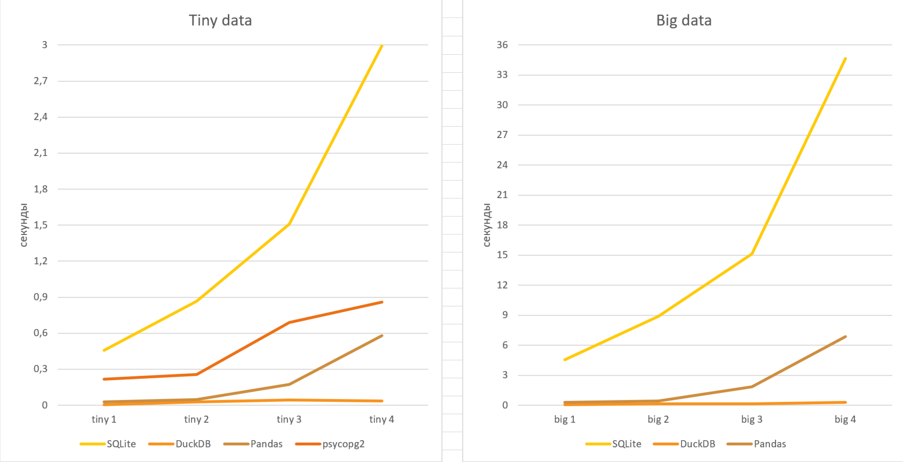

### DATABASE LIBRARIRES

**[GitHub](https://github.com/IciIcifur/data_bases_lab3/tree/master)**
/ Добровольская Олеся, 22ПИ2

Данный проект дает представление о скорости работы популярных библиотек Python для работы с базами данных.

#### Запуск проекта

1. Склонируйте репозиторий.
2. Поместите файлы nyc_yellow_tiny.csv и
   nyc_yellow_big.csv ([ссылка](https://drive.google.com/drive/folders/1usY-4CxLIz_8izBB9uAbg-JQEKSkPMg6)) в папку
   проекта lab3/libraries/data.
2. Измените файл config.txt (при необходимости).
3. Проверьте подключение к интернету и запустите файл main.py: он установит все необходимое на ваше устройство и
   преобразует csv-файлы в базы данных, а затем проведет необходимые тесты. Это может занять время.
4. Результаты исследования (время выполнения запросов в секундах) вы сможете посмотреть в файле results.txt, для
   удобства можете открыть его в Excel, разделив
   по столбцам символом "|".

#### 4 queries

`SELECT vendorid, count(*) FROM nyc_yellow GROUP BY 1`

`SELECT passenger_count, avg(total_amount) FROM nyc_yellow GROUP BY 1`

`SELECT passenger_count, extract(year from tpep_pickup_datetime), count(*) FROM nyc_yellow GROUP BY 1, 2`

`SELECT passenger_count, extract(year from tpep_pickup_datetime), round(trip_distance), count(*) FROM nyc_yellow GROUP BY 1, 2, 3 ORDER BY 2, 4 desc`

#### Результаты тестирования

Итак, DuckDB оказался чемпионом среди всех библиотек, а вот SQLite показал наихудший результат.

*! Данные представлены на основании среднего значения по 10 независимым замерам времени выполнения.*

### Личные впечатления

#### PSYCOPG2

Библиотека работает при подключении к интернету, что не столь удобно и, вероятно, замедляет ее работу. Удобная работа с
csv-файлами отсутсвует, что приводит к очень долгой загрузке базы данных в Postgres.
С точки зрения выполнения запросов удобно, так как они в точности соответствуют синтаксису обычных SQL-запросов.

#### SQLITE

В отличие от psycopg2, SQLite работает непосредственно на устройстве, создавая файл базы данных, чуть превышающий ее
исходный размер, что не всегда можно позволить себе. В то же время данный способ устраняет проблемы интернет-соединения,
гораздо быстрее обращаясь к базе данных.
Как и в случае с предыдущей библиотекой, быстрый способ обработки csv отсутствует, что приводит к большим проблемам.
Синтаксис SQL-запросов практически стандартный, за исключением некоторых агрегатных функцией и особенностей работы с
временными типами данных.

#### DUCKDB

Данная библиотека также создает файл базы данных прямо на устройстве, что неприятно, однако дает преимущество в скорости
интернет-соединения, причем базы данных хранятся в сжатом виде и занимают гораздо меньше памяти, чем исходники, -
здорово.
Очень большим преимуществом можно считать потрясающе быструю работу, в том числе, с максимально удобным преобразованием
csv-файлов в базу данных.
При этом SQL-запросы также практически идентичны, отличаются снова работой с временными типами данных.

#### PANDAS

Данная библиотека сильно отличается от остальных. Файл базы данных хранится в памяти только во время работы программы,
то есть интернет-соединение не имеет значения, но объем оперативной памяти важен.
Работа с csv потрясающая: очень быстрая, преобразующая файл во фрейм, который удобно просматривать и можно легко
изменить.
При этом SQL-запросы требуется преобразовывать и "переводить" на язык Pandas'а,
что не всегда возможно сделать "дословно" и что требует хорошего знания как SQL, так и Pandas.

**Мой личный фаворит - DuckDB, порадовала и не подводила.**